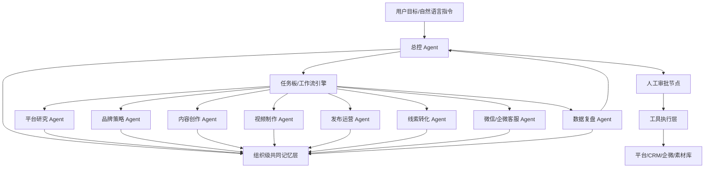

# AI 原生多 Agent 自动化营销系统设计

本文档用于指导后续搭建一个可执行、可审计、可进化的 AI 自动化营销系统。目标不是只让 AI 生成营销建议，而是让 AI 在授权范围内完成研究、策划、生产、发布、接待、转化、复盘，并把经验沉淀为长期记忆。

## 1. 核心判断

你的理解大方向正确：

- Hermes Agent 更适合作为长期运行的智能体执行层，重点价值在长期记忆、任务持续执行、技能沉淀、跨会话上下文。
- OpenClaw 更适合作为外部动作执行器，重点价值在浏览器、网页、桌面、工具调用和非标准系统的自动化操作。
- Codex 更适合作为系统搭建者，负责工程实现、服务开发、数据库、接口、部署、调试和迭代。

但这套系统不能简单理解为“用 Hermes 做脑子，用 OpenClaw 做手”。更稳的设计是：

> 总控 Agent 负责决策编排，专业 Agent 负责领域任务，共同记忆层负责组织知识，工具执行层负责动作，审批系统负责风险控制。

Hermes 可以承载部分或全部 Agent 运行时；OpenClaw 只能作为受控工具，不应直接拥有无边界账号权限。

## 2. AI 原生设计原则

人类工作流通常是线性的：

资料 -> 选题 -> 文案 -> 视频 -> 发布 -> 咨询 -> 客服 -> 成交 -> 复盘

AI 原生工作流应该是闭环的：

目标 -> 规划 -> 并行研究/生产/测试 -> 执行 -> 数据反馈 -> 记忆更新 -> 策略自我修正 -> 下一轮执行

系统的真正能力来自闭环，而不是单次生成。



## 3. 系统角色设计

### 3.1 总控 Agent

职责：

- 理解用户指令。
- 拆解任务。
- 选择专业 Agent。
- 读取和写入共同记忆。
- 判断是否需要人工审批。
- 调用工具执行。
- 汇总结果并继续下一步。

它不应该亲自做所有工作，而应该像一个 AI 项目负责人。

### 3.2 品牌策略 Agent

职责：

- 梳理产品定位、目标人群、卖点、差异化。
- 建立品牌口吻、人设和表达规范。
- 维护禁用词、合规边界、价格政策。
- 根据复盘数据调整营销主张。

输出：

- 品牌画像。
- 客户画像。
- 内容主张。
- 成交路径。
- 合规表达规则。

### 3.3 平台研究 Agent

职责：

- 研究抖音、小红书、视频号的公开爆款内容。
- 分析标题、开头、脚本结构、评论痛点、账号风格。
- 识别趋势，但不复制内容。
- 把研究结果转化为可执行选题。

工具来源：

- 官方 API。
- 授权数据服务。
- 用户提供链接。
- 受控浏览器采集公开页面。
- 人工导入样本。

注意：

不要把“爬取平台内容”作为默认能力，尤其不能绕过登录、风控、版权和平台规则。

### 3.4 内容创作 Agent

职责：

- 生成短视频脚本。
- 生成小红书笔记。
- 生成视频号文案。
- 生成标题、封面文案、评论区引导语。
- 根据平台差异改写同一主题。

它需要读取：

- 品牌记忆。
- 爆款结构记忆。
- 历史内容效果。
- 当前营销目标。

### 3.5 视频制作 Agent

职责：

- 将脚本拆成分镜。
- 匹配素材。
- 生成配音。
- 生成字幕。
- 生成封面。
- 调用剪辑/视频生成工具生成草稿或成片。

建议第一阶段先做“视频草稿生成 + 人工确认”，成熟后再自动排队生产。

### 3.6 发布运营 Agent

职责：

- 做平台适配。
- 生成发布包。
- 设置发布时间。
- 调用官方发布接口。
- 无官方接口时生成待发布草稿。
- 记录发布结果、审核状态、互动数据。

原则：

- 有官方 API 就用官方 API。
- 没有官方 API 就半自动，不要强行模拟真人绕风控。
- 所有发布动作默认需要审批，后续可按低风险账号和低风险内容放宽。

### 3.7 线索转化 Agent

职责：

- 处理评论、私信、表单、落地页咨询。
- 识别客户意向。
- 引导留下联系方式或进入企微/微信客服。
- 把线索写入 CRM。

注意：

不建议直接做个人微信外挂。更稳的方式是使用企业微信、微信客服、小程序表单或 CRM。

### 3.8 微信/企微客服 Agent

职责：

- 基于知识库进行拟人化沟通。
- 识别客户需求、预算、痛点、异议、购买阶段。
- 做多轮跟进。
- 不确定时请求人工协助。
- 高意向时转给人工客服。

它需要强约束：

- 不能乱承诺价格。
- 不能虚假宣传。
- 不能编造案例。
- 不能绕开人工进行高风险成交。

### 3.9 销售辅助 Agent

职责：

- 为人工客服生成客户摘要。
- 推荐跟进话术。
- 生成报价建议。
- 生成异议处理建议。
- 判断转人工时机。

### 3.10 数据复盘 Agent

职责：

- 汇总播放、点赞、收藏、评论、私信、留资、成交。
- 分析内容质量和线索质量。
- 发现高转化选题。
- 更新策略记忆。
- 给下一轮营销提出实验计划。

## 4. 共同记忆层设计

共同记忆层是必须的，但不能让所有 Agent 无限制共享全部信息。

推荐设计为“分层记忆 + 权限检索 + 事件溯源”。

### 4.1 记忆类型

| 记忆类型 | 内容 | 主要使用者 |
| --- | --- | --- |
| 品牌记忆 | 产品、定位、卖点、禁用词、语气、案例 | 全部 Agent |
| 内容记忆 | 历史脚本、爆款结构、平台偏好、素材标签 | 研究/创作/视频/发布 Agent |
| 客户记忆 | 客户画像、咨询记录、需求、预算、异议、阶段 | 客服/销售 Agent |
| 流程记忆 | 任务状态、执行记录、审批状态、工具调用结果 | 总控/运营 Agent |
| 策略记忆 | 哪些策略有效、哪些渠道转化好、实验结论 | 总控/策略/复盘 Agent |
| 工具记忆 | 工具能力、限制、失败原因、最佳调用方式 | 总控/执行 Agent |

### 4.2 记忆写入规则

每个 Agent 完成任务后必须写入结构化结果：

- 做了什么。
- 输入是什么。
- 输出是什么。
- 依据是什么。
- 结果如何。
- 是否需要复盘。
- 是否产生新的品牌/内容/客户/策略记忆。

### 4.3 记忆读取规则

每个 Agent 只读取完成任务所需的最小上下文：

- 内容 Agent 不读取完整客户聊天记录，只读取客户痛点摘要。
- 客服 Agent 不读取所有平台爆款数据，只读取当前活动卖点和话术。
- 视频 Agent 不读取成交金额，只读取目标人群和脚本。
- 发布 Agent 不读取隐私客户资料，只读取发布资产和平台规则。

### 4.4 推荐存储

- PostgreSQL：结构化业务数据、任务、审批、客户、发布记录。
- pgvector 或 Qdrant：向量检索知识库、内容样本、对话摘要。
- Redis：任务状态、短期上下文、锁、队列缓存。
- 对象存储：图片、视频、音频、素材、生成成片。
- 审计日志库：工具调用、权限变更、Agent 决策记录。

## 5. 工具执行层设计

工具执行层分为四类：

### 5.1 官方 API 工具

优先级最高。

- 抖音开放平台。
- 企业微信。
- 微信客服。
- CRM。
- 短信/邮件。
- 视频生成 API。
- TTS/ASR。
- 对象存储。

### 5.2 浏览器自动化工具

可由 OpenClaw 或类似工具承担。

适合：

- 打开后台。
- 生成草稿。
- 辅助采集公开信息。
- 填表。
- 下载报告。
- 操作没有 API 的内部系统。

不适合：

- 绕过平台限制。
- 大规模模拟真人互动。
- 无审批发布敏感内容。
- 管理支付、合同、删除、批量私信等高风险动作。

### 5.3 内容生成工具

- LLM。
- 图片生成。
- 视频生成。
- TTS 配音。
- 字幕生成。
- 剪辑合成。

### 5.4 业务系统工具

- CRM。
- 表单。
- 企微。
- 知识库。
- 任务板。
- 数据看板。

## 6. 权限与审批设计

把工具调用按风险分级。

| 风险等级 | 动作 | 策略 |
| --- | --- | --- |
| L0 | 检索知识库、生成草稿、总结数据 | 自动执行 |
| L1 | 生成营销计划、生成脚本、生成视频草稿 | 自动执行并记录 |
| L2 | 创建发布草稿、回复普通咨询、更新客户标签 | 可自动，但要可回滚 |
| L3 | 正式发布、批量发送、客户报价、添加客户 | 默认人工确认 |
| L4 | 收款、签约、删除数据、账号安全设置 | 必须人工操作或强审批 |

## 7. 推荐技术架构

### 7.1 后端

- Python FastAPI 或 Node.js NestJS。
- PostgreSQL + pgvector。
- Redis + Celery/RQ/BullMQ。
- S3 兼容对象存储。
- Agent Runtime：Hermes Agent + 自研 Orchestrator。
- 工具执行：OpenClaw/Browser Use/Playwright + 官方 API SDK。

### 7.2 前端

- Next.js 或 React。
- 页面包括：
  - 对话式 AI 工作台。
  - 知识库管理。
  - 内容资产库。
  - 任务板。
  - 审批中心。
  - 客户线索 CRM。
  - 发布日历。
  - 数据复盘看板。

### 7.3 Agent Runtime

建议做双层：

1. 应用层 Orchestrator：由我们自己实现，负责业务状态、权限、审计、任务编排。
2. Hermes Agent：作为长期智能体执行器，负责复杂任务、多步执行、长期记忆和技能沉淀。

不要把业务关键状态只放在 Agent 聊天上下文里。业务状态必须落库。

## 8. MVP 版本范围

第一版不要追求全自动发布全平台。建议先做可用闭环：

1. 用户上传资料。
2. 系统建立品牌知识库。
3. 用户在对话框下达目标。
4. 总控 Agent 生成营销计划。
5. 研究 Agent 根据样本和公开信息生成选题。
6. 内容 Agent 生成脚本/图文。
7. 视频 Agent 生成视频草稿或视频制作指令。
8. 人工确认。
9. 发布运营 Agent 生成平台发布包。
10. 客户从表单/企微进入。
11. 客服 Agent 基于知识库接待。
12. 高意向客户转人工。
13. 复盘 Agent 更新策略记忆。

## 9. 数据模型草案

核心表：

- users
- workspaces
- brand_profiles
- knowledge_documents
- memory_items
- agents
- agent_tasks
- agent_messages
- tool_calls
- approvals
- content_topics
- content_assets
- video_projects
- publishing_jobs
- platform_accounts
- leads
- customer_conversations
- sales_handoffs
- performance_metrics
- experiments

### memory_items 建议字段

- id
- workspace_id
- memory_type
- title
- content
- summary
- source_type
- source_id
- visibility_scope
- confidence
- importance
- embedding
- created_by_agent
- created_at
- updated_at

### agent_tasks 建议字段

- id
- workspace_id
- parent_task_id
- agent_type
- objective
- input_context
- output_result
- status
- risk_level
- approval_required
- assigned_tools
- started_at
- finished_at

## 10. Agent 协作协议

每个 Agent 输出必须包含：

```json
{
  "task_summary": "本次任务完成了什么",
  "key_findings": ["关键发现"],
  "artifacts": ["生成的内容/文件/链接"],
  "memory_updates": [
    {
      "type": "strategy|brand|content|customer|tool|workflow",
      "title": "要写入的记忆标题",
      "content": "结构化记忆内容",
      "importance": 1
    }
  ],
  "next_actions": ["建议下一步"],
  "risk_flags": ["风险或需要人工确认的点"]
}
```

总控 Agent 只接受这种结构化结果，并决定下一步。

## 11. 自我学习机制

自我学习不是让 Agent 任意修改自己，而是三个层次：

### 11.1 经验学习

把成功/失败任务写入策略记忆。

例：

- “痛点型开头在小红书留资率高。”
- “直接报价会降低回复率。”
- “某类封面在抖音点击率低。”

### 11.2 工具学习

记录工具调用失败原因和最佳参数。

例：

- “某视频生成工具 9:16 参数更稳定。”
- “某平台发布接口需要先上传视频再创建作品。”

### 11.3 流程学习

优化任务拆解和审批策略。

例：

- “低风险产品知识答疑可自动回复。”
- “涉及价格承诺必须转人工。”

## 12. 安全和合规边界

必须内置：

- 审批日志。
- 工具调用日志。
- 客户隐私保护。
- 敏感词和虚假宣传检测。
- 平台规则检查。
- 人工接管机制。
- 账号权限隔离。
- OpenClaw/浏览器自动化沙盒。

## 13. 实施路线

### 阶段 1：系统地基

- 建立后端服务。
- 建立数据库。
- 建立知识库。
- 建立对话式工作台。
- 实现总控 Agent。
- 实现任务表和记忆表。

### 阶段 2：内容生产闭环

- 品牌策略 Agent。
- 平台研究 Agent。
- 内容创作 Agent。
- 内容资产库。
- 人工审批中心。

### 阶段 3：视频生产闭环

- 视频脚本转分镜。
- 配音。
- 字幕。
- 封面。
- 视频草稿生成。

### 阶段 4：发布和数据回流

- 发布日历。
- 发布包生成。
- 官方 API 接入。
- 半自动发布工具。
- 数据回收。

### 阶段 5：企微/客服/销售闭环

- 线索表。
- 企微/微信客服接入。
- 客服 Agent。
- 转人工机制。
- 客户记忆。

### 阶段 6：Hermes/OpenClaw 深度接入

- Hermes 作为长期 Agent 执行器。
- OpenClaw 作为受限动作执行器。
- 工具权限系统。
- Agent 自我复盘和技能沉淀。

## 14. 当前本机 Hermes 状态

本机已检测到 Hermes 命令可运行，但当前状态显示：

- Gateway 未启动。
- 模型/API Key 未配置。
- OpenRouter/OpenAI/Anthropic 等 Key 未配置。
- WeCom/微信相关通道未配置。
- 当前无 active session。

因此后续搭建时需要先完成：

1. 配置模型供应商。
2. 配置 Hermes auth。
3. 启动 Hermes gateway。
4. 配置企业微信或微信客服通道。
5. 把 Hermes 接入本系统 Orchestrator。

## 15. 下一步工程任务

建议下一步直接进入 MVP 工程搭建：

1. 创建 monorepo 项目结构。
2. 初始化后端 API。
3. 初始化前端工作台。
4. 建立 PostgreSQL schema 草案。
5. 实现 memory_items、agent_tasks、approvals 三个核心模块。
6. 实现一个最小总控 Agent，可以根据用户指令创建任务、读写记忆、输出营销计划。
7. 再接入 Hermes 和 OpenClaw。

## 16. 参考资料

- Hermes Agent GitHub：https://github.com/nousresearch/hermes-agent
- Hermes Agent 官方介绍：https://nousresearch.com/hermes-agent/
- OpenClaw 浏览器工具文档：https://docs.openclaw.ai/browser
- OpenClaw tools/browser 文档：https://docs.openclaw.ai/tools/browser

## 17. Agent 模型接入策略

多 Agent 系统不应该所有角色都使用同一个模型。推荐采用“模型路由器 + 角色默认模型 + 任务动态升降级”的方式。

### 17.1 接入原则

- 总控 Agent、策略 Agent、复杂研究 Agent 使用高推理模型。
- 高频客服、分类、标签、摘要、格式转换使用低成本小模型。
- 工具执行前的决策和高风险动作审批使用更强模型复核。
- 内容生成可以使用中高模型，但最终发布前要经过合规/品牌一致性检查。
- 视频、图片、语音、转写使用专门模型，不强行交给通用文本模型。
- 所有 Agent 调用模型都必须记录：模型、prompt 版本、输入摘要、输出摘要、成本、延迟、是否命中人工审批。

### 17.2 推荐模型分层

| 层级 | 用途 | 推荐 |
| --- | --- | --- |
| S 级 | 总控、复杂策略、关键审批、高风险销售判断 | GPT-5.5 / Claude Opus / Gemini Pro 级别 |
| A 级 | 研究、内容创意、脚本、复杂客服 | GPT-5.4 / Claude Sonnet / Gemini Flash-Pro 级别 |
| B 级 | 日常客服、摘要、标签、改写、轻量任务 | GPT-5.4 mini / GPT-5 mini / Qwen/DeepSeek/Kimi 同级 |
| C 级 | 分类、去重、路由、格式检查、批处理 | nano/mini/本地小模型 |
| 专用 | 图片、视频、语音、转写、向量 | 专门模型 |

### 17.3 本系统建议默认分配

| Agent | 默认模型策略 |
| --- | --- |
| 总控 Agent | 高推理模型；涉及任务拆解、权限和跨 Agent 协调时使用 S/A 级 |
| 品牌策略 Agent | A 级；重大定位调整或长期策略复盘升到 S 级 |
| 平台研究 Agent | A 级 + 搜索/浏览工具；简单样本总结可降到 B 级 |
| 内容创作 Agent | A/B 级混合；批量初稿用 B 级，爆款脚本和关键活动用 A 级 |
| 视频制作 Agent | 文本分镜用 B/A 级，成片调用视频专用模型 |
| 发布运营 Agent | B 级；正式发布前用 A 级做合规检查 |
| 线索转化 Agent | B 级为主；高意向和价格异议升到 A 级 |
| 微信/企微客服 Agent | B 级为主；复杂异议、投诉、成交节点升到 A/S 级 |
| 销售辅助 Agent | A 级；成交判断和报价建议建议双模型复核 |
| 数据复盘 Agent | A 级；大批量统计先用代码/SQL，再由模型解释 |
| 记忆整理 Agent | B 级；高价值策略记忆由 A 级复核 |

### 17.4 模型路由器

系统需要一个 model_router，根据以下因素选择模型：

- agent_type
- task_type
- risk_level
- expected_latency
- budget_level
- context_size
- tool_required
- output_format
- user_priority

示例规则：

```json
{
  "agent_type": "customer_service",
  "task_type": "price_objection",
  "risk_level": "L3",
  "default_model": "gpt-5.4-mini",
  "escalate_to": "gpt-5.4",
  "approval_required": true
}
```

### 17.5 多供应商策略

建议从第一天就抽象 Provider Adapter，不要把系统绑死在一个模型供应商。

需要支持：

- OpenAI：主力通用推理、多模态、工具调用、Responses API、Agents SDK。
- Anthropic：长文本、策略、审慎写作、复杂判断的备选。
- Google Gemini：长上下文、多模态和成本备选。
- 国产模型：中文客服、私有部署、成本控制、合规部署。
- 本地/开源模型：分类、脱敏、低风险批处理、隐私场景。

### 17.6 推荐 API 方式

对新项目，OpenAI 侧优先使用 Responses API，因为它更适合 agentic workflow、工具调用、多轮状态和内置工具。多 Agent 编排可以参考 Agents SDK，但业务状态、权限、审批和记忆仍由本系统自己持久化。

### 17.7 成本控制

- 默认用小模型做第一轮。
- 只有在高风险、低置信度、复杂推理时升级模型。
- 对批量任务使用异步队列。
- 对重复品牌资料和系统提示做 prompt caching。
- 对长文档先检索后生成，避免整库塞进上下文。
- 对客服高频话术做模板化和 RAG，而不是每轮都让大模型重新思考。

### 17.8 质量控制

- 关键动作双模型复核。
- 内容发布前做品牌一致性检查和合规检查。
- 客服回复必须基于知识库引用或内部事实。
- 对每个模型输出记录人工反馈，用于后续路由优化。
- 每个 Agent 维护自己的 prompt 版本和评估集。
